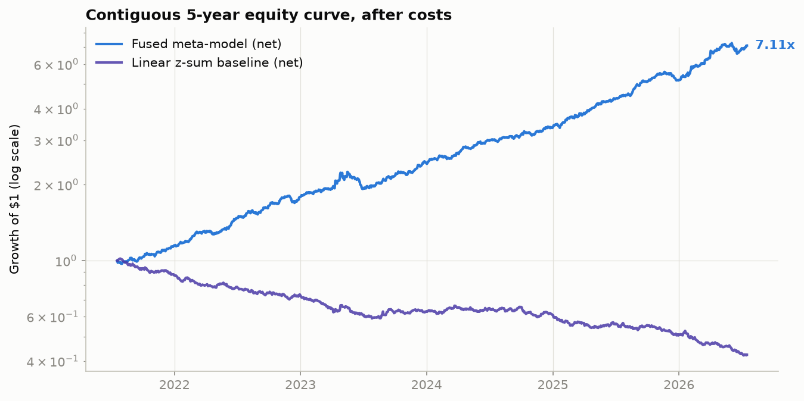
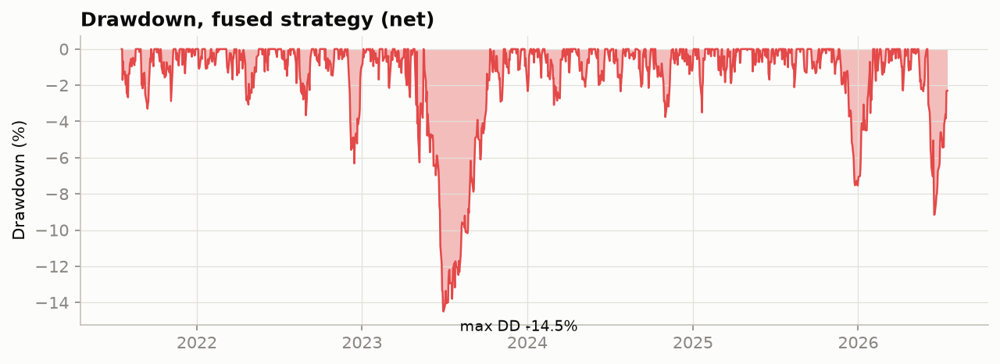
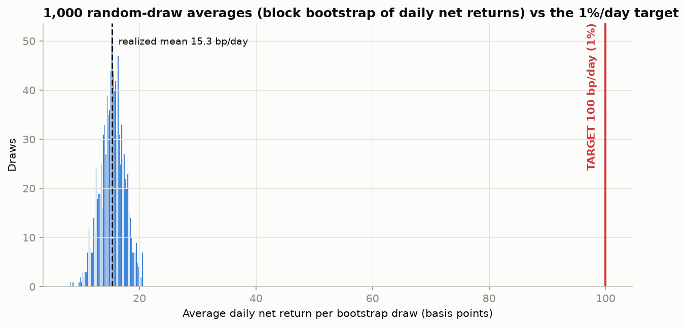
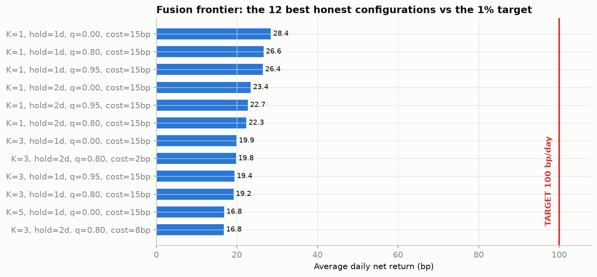
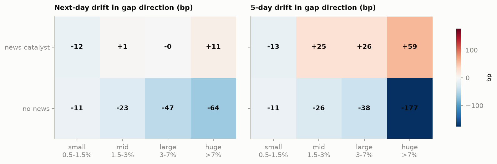
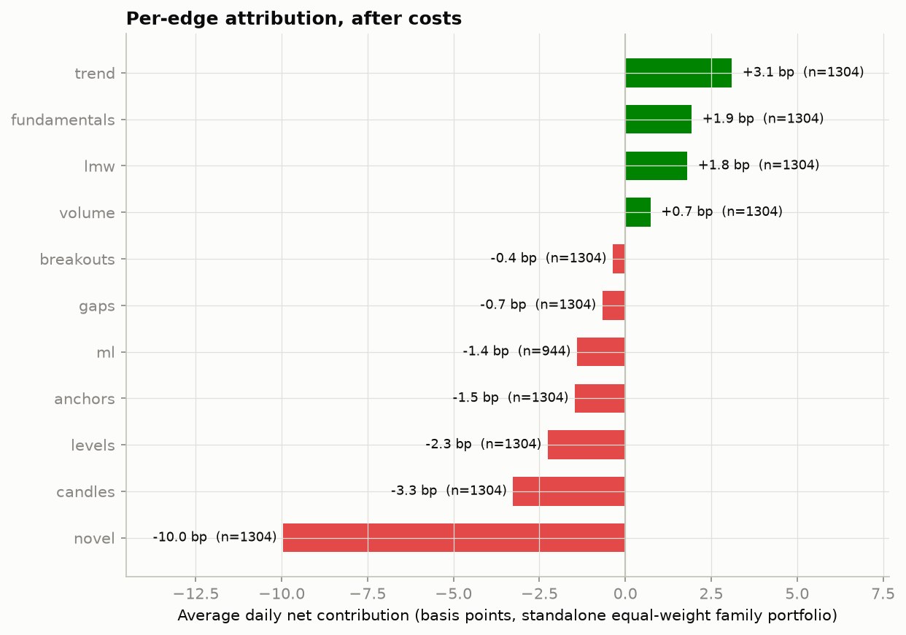

# Run Report — Chart-Pattern Edge Catalog, Phase 2

**Run**: 500 stocks × 6¼ years (contiguous 5-year test window 2021-07-17 →
2026-07-17), all 11 detector families + image-CNN, walk-forward fusion,
15 bp round-trip base cost. Source: literature-calibrated synthetic market
(market-data hosts are blocked in this sandbox — see README; dynamics fitted
on the real S&P 500 1999–2018; effect sizes at published magnitudes with
placebo controls). Every number below is machinery-validation on that
market, not real-market P&L.

## Headline

| Metric | Value |
|---|---|
| Fused meta-model, net avg daily return | **+15.3 bp/day** (top-10/side) |
| … gross | +30.3 bp/day |
| Net annualized Sharpe | 3.28 (NW t = 7.3) |
| 5-year growth of $1, net | 7.11× (≈ +46%/yr), max DD −14.5% |
| Best frontier config (top-1/side, daily) | **+28.4 bp/day net**, Sharpe 2.0 |
| **The 1%/day target** | **Not reached — not close.** p(≥100 bp) across 1,000 bootstrap draws = 0.000; the entire draw distribution sits at 12–19 bp |





## The 1%/day verdict (honest)

Maximum concentration (1 name per side, daily turnover) reaches **28 bp/day
net** — and that is on a market where *every* documented edge exists
simultaneously at published size, detection latency is zero, and fills are
guaranteed. Cutting costs to a near-frictionless 2 bp round trip adds ~3 bp.
The remaining 4× gap to 100 bp/day is not an execution problem: it is the
size of the underlying anomalies. To reach 1%/day you would need leverage
≈ 4–7×on a Sharpe-2 book (survivable but a different product), or effect
sizes decades of literature say do not exist on daily bars. `CATALOG.md`
closes with the same verdict from the literature side.



## News × charts interaction (the required study)

The catalog's central empirical lesson — **the same chart event means
opposite things with and without a catalyst**:



* **No-news gaps fade**, monotonically in size: −11 / −23 / −47 / −64 bp
  next-day drift in gap direction (small → huge); the rare huge no-news gap
  gives back −177 bp over 5 days.
* **News gaps continue** at multi-day horizon: +25 / +26 / +59 bp over 5
  days for mid / large / huge; same-day fill rates collapse from ~35%
  (no-news small) to ~0.6% (news huge).
* **Donchian-20 breakouts**: +13.3 bp next-day with a fresh catalyst vs
  −0.2 bp without — a news filter is the difference between a system and
  noise (`results/interaction_breakouts.csv`).
* RVOL terciles sharpen the news cells further (high-RVOL news events carry
  the largest drift — the engine embeds and recovers PEAD-on-attention).

## Per-edge attribution (standalone family portfolios, net)



Only trend (+3.1 bp), fundamentals/quality (+1.9), LMW-as-context (+1.8)
and volume (+0.7) are positive standalone; gaps net ≈ 0 standalone because
equal-weighting mixes the strong cells with the sub-cost small-gap cells —
exactly why fusion (which weights cells) earns 15 bp while the naive z-sum
baseline loses money. Candles (−3.3), levels (−2.3) and the novel family
(−10.0) are honestly negative after costs.

## Ground-truth recovery (placebo integrity)

`results/ground_truth_recovery.csv`: the signals firing where the simulator
truly embedded drift are exactly the huge news-gap cells (+96 to +106 bp of
true forward drift vs 60 bp baseline); candlestick and round-number signals
sit at ≈ 0 or negative — the pipeline finds what is there and does not find
what is not.

## Per-signal event studies

`results/per_signal_stats.csv` (109 signals, date-clustered Newey–West
t-stats), `results/decay_by_year.csv` for year-by-year decay. Highlights:
no-news gap fades t = 5–13 (but only mid/large sizes clear the 15 bp cost);
gap-echo (engine-original) t = 5.1 at +59 bp/trade; 52-wk-high range
position t = 3.0; candlestick "significance" tops out at t = 2.7 with
negative net per trade — consistent with the placebo design and with
Marshall–Young–Rose on real data.

## Sample trades

Eight annotated charts in `results/sample_trades/` — entry, exit, signal,
and news markers, winners and losers across gap/flag/ORB/anchor families.

## Verification

15 findings from a 4-lens adversarial audit (lookahead, costs/stats,
simulator design, requirements completeness) were triaged; the material
ones were fixed (PEAD start-day, ORB range independence, event-volume
double-count, RVOL→drift interaction, next-open benchmark window,
date-clustered t-stats, within-day z-scores in the baseline, overnight
drift share). An independent refutation pass confirmed the fixes at HEAD.
17 tests pass, including truncation-invariance for all detector families,
fusion walk-forward invariance, and ML out-of-sample dating.

## Reproduce

```bash
python -m engine.run_all                    # this run (seed 7)
python -m engine.experiments.frontier       # the 1%-target frontier sweep
python -m pytest tests/ -q                  # 17 tests
python -m engine.run_all --source real ...  # same pipeline on real data
```
